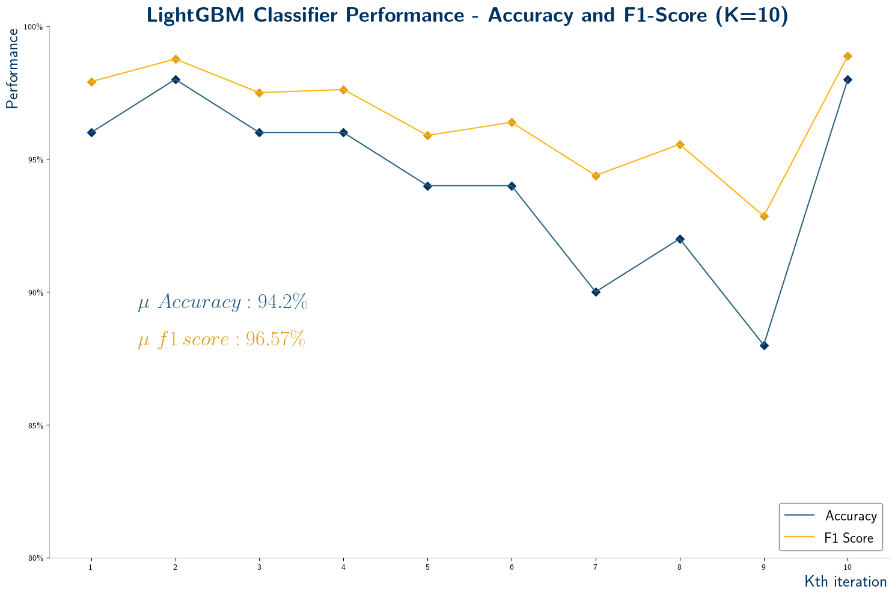
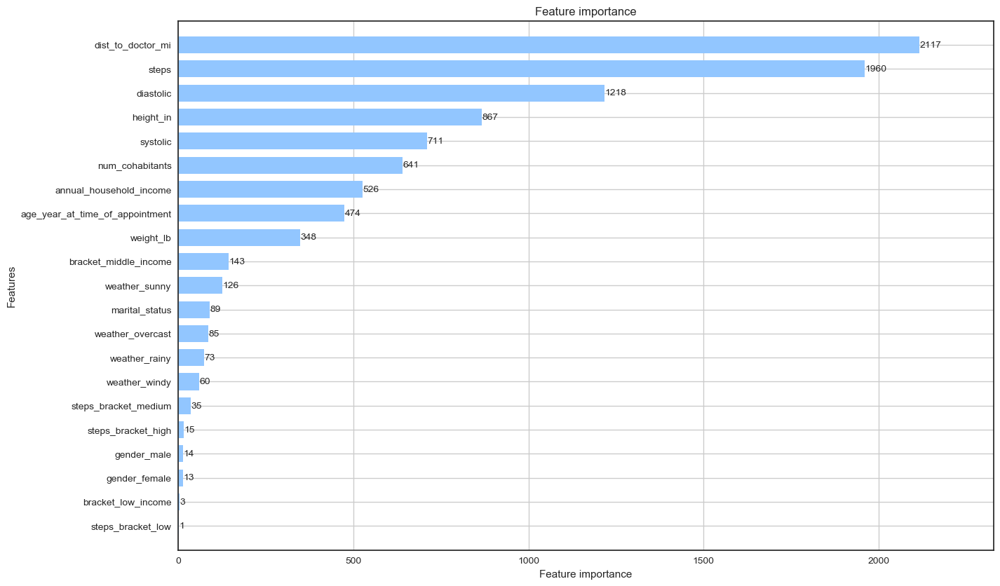

Simple LightGBM Classifier
===========================

    


#### Authors : [Cristopher Benge](https://cbenge509.github.io/) 

[](https://sourcerer.io/fame/cbenge509/cbenge509/arxiv-ai-analysis/links/0)[](https://sourcerer.io/fame/cbenge509/cbenge509/arxiv-ai-analysis/links/1)[](https://sourcerer.io/fame/cbenge509/cbenge509/arxiv-ai-analysis/links/2)[](https://sourcerer.io/fame/cbenge509/cbenge509/arxiv-ai-analysis/links/3)[](https://sourcerer.io/fame/cbenge509/cbenge509/arxiv-ai-analysis/links/4)[](https://sourcerer.io/fame/cbenge509/cbenge509/arxiv-ai-analysis/links/5)[](https://sourcerer.io/fame/cbenge509/cbenge509/arxiv-ai-analysis/links/6)[](https://sourcerer.io/fame/cbenge509/cbenge509/arxiv-ai-analysis/links/7)

<br>

---

## Description


Jupyter Notebook containing simple data pre-processing and training, evaluation, and reporting of a LightGBM Classifier trained on a binary classification task.  The data consists of example patient demographics, blood pressure and steps-per-day telemetry measurements, and some information regarding the distance to the doctors office and the weather on the day of the visit.  The task of the classifier is to predict whether or not a patience will make their appointment or not.

Model Performance | Feature Imporance
:----------------:|:------------------:
|  |  |

---

## Key Solution Files


  |File | Description |
  |:----|:------------|
  |[classifier.ipynb](classifier.ipynb) | Jupyter Notebook containing walk-through of data processing, model cross-validation, and plotting of performance and feature imporance.|
  |[appointments_v2.csv](/data/appointments_v2.csv) | contains the list of patient appointment days and the label (attended) for this ML task. |
  |[daily_measurements_v2.csv](/data/daily_measurements_v2.csv) | contains a daily list of patient blood-pressure readings and step counts. |
  |[patients_v2.csv](/data/patients_v2.csv) | contains a basic demographic list of [fictive] patient data. |
  
---

## Performance

This solution achieves a score of **94.2% accuracy** and **96.57% f1**.  No separate test dataset was provided, so evaluation is against a non-stratified KFold (K=10) scheme.

---

## Evaluation Criteria

This project was measured against the standard classification [accuracy score](https://scikit-learn.org/stable/modules/generated/sklearn.metrics.accuracy_score.html) and [f1 score](https://scikit-learn.org/stable/modules/generated/sklearn.metrics.f1_score.html?highlight=f1_score#sklearn.metrics.f1_score).

---

## Model Architecture

An implementation of a gradient boosted decision tree ([LightGBMClasifier](https://lightgbm.readthedocs.io/en/latest/pythonapi/lightgbm.LGBMClassifier.html)) was used.  Below is a simple example of its use in the project:

```python
import lightgbm as lgb
params = {'n_jobs':-1, 'random_state': 42, 'n_estimators': 500, 'learning_rate': 0.01}
model = lgb.LGBMClassifier(**params)

model.fit(x, y, verbose = False)
```

---

## License

Licensed under the MIT License. See [LICENSE](LICENSE.txt) file for more details.
